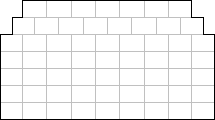

# Fake cinema API

Fake cinema API for KN Solvro recruitment task.

## Project Setup

1. Fork/Clone
1. Install Dependencies - `npm install`
1. Run - `npm start`

## Endpoints

1. GET http://localhost:5000/ping
1. POST http://localhost:5000/movie

## Requests

### Movie

Movie number must be provided. Sample movie number: `78483421`.

Success:

```sh
$ curl http://localhost:5000/movie \
  -H "Content-Type: application/json" \
  -X POST \
  -d '{"movie":"78483421"}'

{
  "status":"success",
  "title":"Wojownicy Solvro, Więzień KNSI",
  "sessions":[1561372200,1561379400,1561386600,1561390200],
  "arrangement":
  {
  "A":[{"1":1},{"2":0},{"3":1},{"4":1},{"5":1},{"6":0},{"7":1}],
  "B":[{"1":1},{"2":1},{"3":0},{"4":1},{"5":1},{"6":1},{"7":1},{"8":1}],
  "C":[{"1":1},{"2":0},{"3":0},{"4":1},{"5":0},{"6":0},{"7":0},{"8":1},{"9":0}],
  "D":[{"1":0},{"2":0},{"3":1},{"4":0},{"5":1},{"6":0},{"7":0},{"8":1},{"9":0}],
  "E":[{"1":1},{"2":1},{"3":1},{"4":0},{"5":0},{"6":1},{"7":1},{"8":1},{"9":0}],
  "F":[{"1":0},{"2":0},{"3":0},{"4":0},{"5":1},{"6":0},{"7":1},{"8":0},{"9":0}],
  "G":[{"1":1},{"2":1},{"3":1},{"4":1},{"5":1},{"6":1},{"7":1},{"8":1},{"9":1}]}
  }
}
```

## Interpretation

### Sessions

Seance hours available under the `sessions` field, are provided with timenstamps.

### Arrangement

The level of room filling is an object containing fields being consecutive rows marked with letters, each containing list of pairs {seat: occupancy}, where the occupancy is the boolean value: 0 - free, 1 - occupied.

### Cinema hall sample appearance



## Author

Maciej Hajduk - [okkindel.github.io](http://okkindel.github.io).
